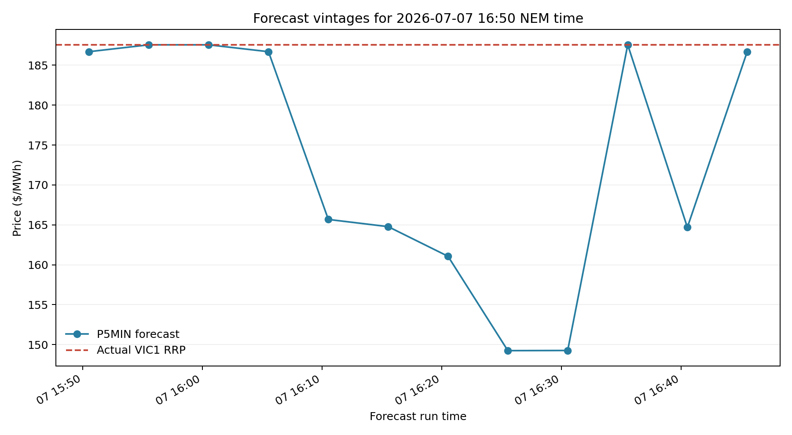
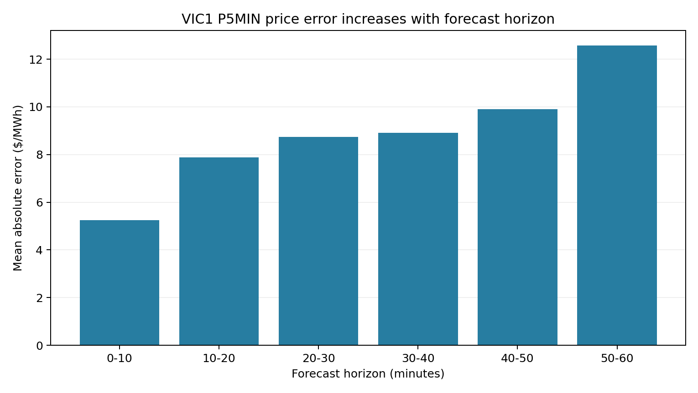

# VIC Forecast Monitor

An interactive historical analysis of when AEMO's public Victorian electricity-market forecasts diverged from actual outcomes.

The project will compare forecast and realised price, demand, renewable output and interconnector conditions across forecast horizons. Its core design preserves both forecast issue time and target time so that every result can be audited for lookahead.

Planned outputs include:

- historical forecast-versus-reality replay;
- forecast-error scorecards and heatmaps;
- an explorer for the largest forecast misses;
- a detailed Victorian price-event case study; and
- an optional calibrated spike-risk model, promoted only if it improves on transparent baselines out of sample.

## Forecast-disagreement model

The dashboard compares AEMO's approximately 30-minute P5MIN forecast with an independent estimate of the eventual VIC1 RRP. The model uses the AEMO forecast, demand, solar and wind UIGF, net interchange, forecast revisions, calendar terms, and prices already known at issue time.

The top chart is a rolling feed from AEMO's Current P5MIN and DispatchIS reports. GitHub Actions refreshes it every 15 minutes. It plots AEMO's forecast, model fair value, and the realised VIC1 RRP on the same timeline; actuals remain blank for intervals that have not dispatched yet.

The split is chronological: January–September 2025 is used for training and October–December 2025 is untouched test data. On that test period, AEMO's MAE was **$15.23/MWh** and the model's MAE was **$13.89/MWh**, an **8.8% improvement**. This is encouraging forecasting evidence, not a backtest of executable trading P&L. The displayed `MODEL HIGHER` and `MODEL LOWER` labels mean the model differs from AEMO by at least $25/MWh; a real trade still depends on asset exposure, bids, constraints, liquidity, and transaction costs.

## 2025 headline results

The full 2025 vintage-aware dataset is complete and passed its integrity audit:

- **105,120** realised five-minute VIC1 intervals;
- **1,260,636** matched P5MIN forecast vintages;
- all 12 months complete at five-minute spacing;
- zero duplicate forecast vintages;
- zero missing matched actual prices; and
- zero forecasts available after their target interval.

Across 2025, mean absolute error increased from **$15.27/MWh** at a 0-10 minute horizon to **$45.81/MWh** at 50-60 minutes. At a fixed 30-minute lead, the worst 1% of intervals contributed **39%** of total absolute error. There were **166** intervals above $1,000/MWh and the maximum realised price was $17,500/MWh.

The largest 30-minute miss was an over-forecast on 11 June: **$16,961.09/MWh forecast versus $228.64/MWh realised**. The forecast fell to $224.13/MWh by roughly four minutes out, demonstrating why forecast vintage matters. Read the [case study](docs/case-study-2025-06-11.md).

The first explanatory extension joins forecast and realised regional demand across the full year. At a fixed 30-minute lead, demand MAE was **82.43 MW** with near-zero bias. Absolute demand error had only **0.013 correlation** with absolute price error, so demand misses alone do not explain the largest price misses.

The next layer adds solar UIGF, wind UIGF and regional net interchange for every vintage. Thirty-minute regional net-interchange MAE was **152.49 MW**, but its absolute error had only **0.019 correlation** with absolute price error. Solar/wind values are reported as UIGF-to-cleared-dispatch gaps rather than forecast errors because dispatch and curtailment intervene.

## Feasibility prototype

For 1-7 July 2026, the pipeline reconstructed:

- 2,016 realised five-minute VIC1 intervals;
- 24,126 matched P5MIN forecast vintages;
- a median of 12 forecast vintages per target interval;
- zero missing matched actual prices; and
- zero forecast records whose availability timestamp occurred after their target interval.

The sample is a pipeline feasibility test, not yet a representative assessment of forecast performance. In this week, forecast errors ranged from -$214.14/MWh to $314.31/MWh and averaged -$1.60/MWh across all vintages and horizons.





The pipeline uses AEMO's compact monthly MMSDM archives. The complete 2025 source download is roughly 650 MB.

## Run the prototype

```bash
py -3.12 -m venv .venv
python -m pip install -e ".[dev]"
python -m vic_forecast_monitor.prototype --start 2026-07-01 --end 2026-07-07
python -m vic_forecast_monitor.analysis
python -m vic_forecast_monitor.monthly --month 2025-07
python -m vic_forecast_monitor.monthly --year 2025
python -m vic_forecast_monitor.analysis --panel data/processed/forecast_actual_panel_2025.parquet
python -m vic_forecast_monitor.enrich --year 2025
python -m vic_forecast_monitor.enrich --year 2025 --conditions
python -m vic_forecast_monitor.analysis --panel data/processed/forecast_actual_panel_2025_enriched.parquet
pytest
```

The command downloads and caches original AEMO archives, writes a SHA-256 source manifest, exports parquet datasets and produces a forecast-vintage replay chart. Raw downloads are ignored by Git.

## Dashboard

```bash
cd dashboard
npm install
npm run dev
```

The React/Vite dashboard reads versioned static JSON exports and includes headline metrics, horizon analysis, full forecast-revision replays, a largest-miss explorer, findings and methodology.

## Principles

- Use only information available at the stated forecast time.
- Preserve forecast vintages and source provenance.
- Prefer simple, defensible analysis over opaque complexity.
- Report negative and inconclusive results honestly.

## Data

The project uses public Australian Energy Market Operator market data. Raw archives will not be committed to Git; reproducible download and transformation scripts will be provided.

## Author

Built by Sparsh Basantani.
